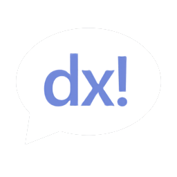
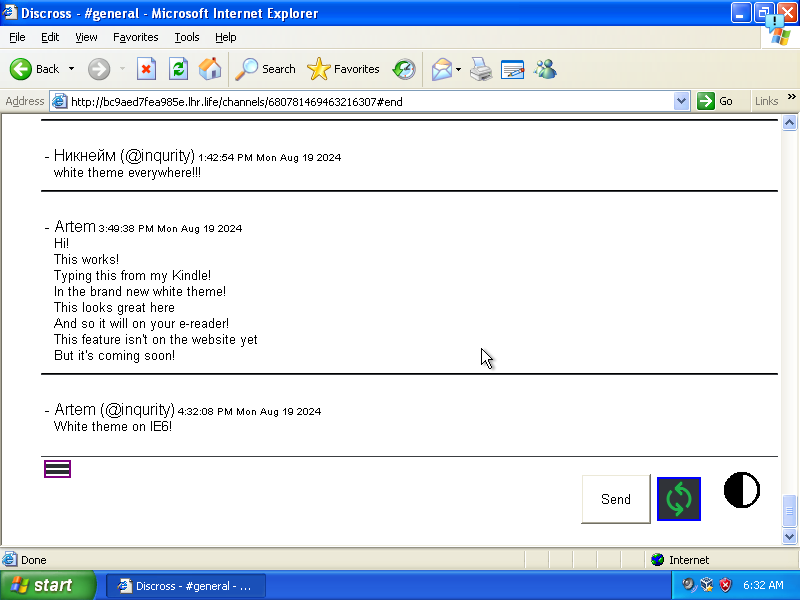
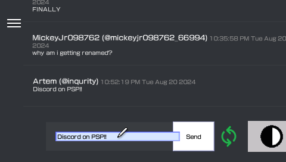
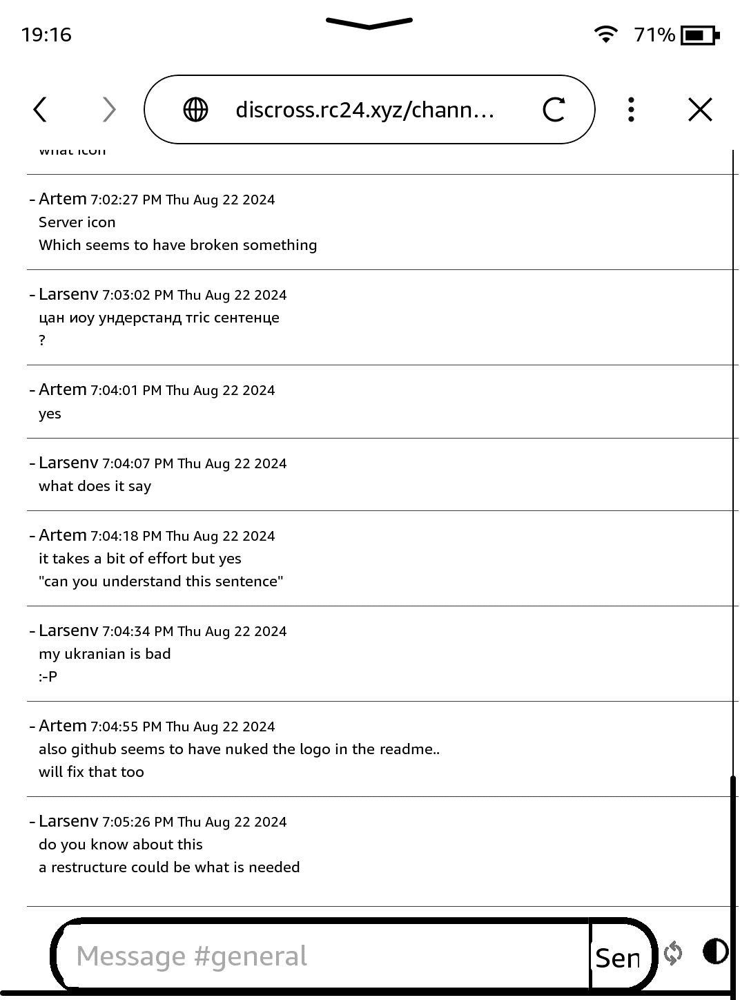

<p align="center" dir="auto"><a href="https://discross.net/" rel="nofollow"></a></p>

**Discross** is a webhook bridge to send messages on Discord aimed at supporting all platforms that support HTML.

# Try it!

We have opened the [official Discross Discord server!](https://discord.gg/YrPG9krvVF) Come and say hi!
You can try out Discross there without having to invite the bot to your own server.

## Usage

### All of these steps have to be performed on a modern device that can access Discord.com

0. Use the [link](https://discordapp.com/oauth2/authorize?client_id=968999890640338955&scope=bot&permissions=8) to add Discross to your server. Not necessary if you're already on a server with the bot.
1. Type `^connect` on the server to get your verification code
2. Go to [discross.net](https://discross.net/)
3. Register on the website with that code
4. Click the "update your server list" button to authorize Discross with your Discord account (only required on first login or when you've added/removed servers)

### Now you can use Discross on all of your devices by logging into the account you have just made!

### Supported platforms

Platforms that are confirmed to work, to some extent:

- iPad
- iPhone
- Kindle
- Nintendo 3DS
- Nintendo DS
- Nintendo DSi
- Nintendo Switch
- PlayStation 3
- PlayStation 4
- PlayStation 5
- PlayStation Portable
- PlayStation Vita
- Sega Dreamcast
- Wii Internet Channel
- Wii U
- Windows 95
- Windows 98
- Windows XP
- Xbox 360
- Xbox One

## Screenshots!





## Hosting

### WARNING!! database file relocated to db/discross.db. Please move your database file to the new location if you are updating from an older version.

```bash
mv secrets/database.db db/discross.db
```

### Without docker

Make sure the following are installed:

- Node.js
- Python
- Visual Studio Build Tools

```bash
git clone https://github.com/larsenv/discross.git
cd discross
mkdir secrets
cd secrets
```

copy your key.pem and cert.pem files here if you are using HTTPS

```bash
cd ..
mkdir db
touch db/discross.db
npm install
```

replace the token in the line below with your bot's token

```bash
export TOKEN=discord_bot_token_here
npm start
```

### With docker

Make sure you have [Docker](https://www.docker.com/get-started/) and [Docker Compose](https://docs.docker.com/compose/install/) installed.

Or if you're on Windows or Mac, just install [Docker Desktop](https://www.docker.com/products/docker-desktop/).

```bash
git clone https://github.com/larsenv/discross.git
cd discross
mkdir secrets
cd secrets
```

copy your key.pem and cert.pem files here if you are using HTTPS

```bash
cd ..
mkdir db
touch db/discross.db
cp .env.example .env
```

replace the token in .env with your bot's token

```bash
docker compose up -d
``` 

### Bot setup
Go to [discord.dev](https://discord.com/developers/applications) and create a new application

In the application menu go to "Bot" and click on "Reset Token"

Copy the token and paste it into token.txt. Keep this token secure and never share it publicly, as it provides full access to your bot.

Now invite the bot onto your server

Go to "OAuth2"

Click "Add Redirect" and type in `http://localhost:4000/discord.html`

Below, click "bot"

Select the redirect and choose the "Manage webhooks" permission

Copy the URL and paste it in a new tab to invite the bot

To authorize the bot with your Discord account (this has to be done every time you add a new server), deselect "bot" and tick "identify" and "guilds"

Copy the link again, but replace `response_type=code` with `response_type=token`

Paste the link into a new tab and press "Authorize"

Open Discord and type ^connect in the same server you invited the bot in

The bot will send you a verification code in DMs

Go to [localhost:4000](http://localhost:4000) and use it to register

### Discross is made by [circuit10](https://github.com/Heath123) (Heath123 is circuit10's GitHub username)

## Contributors

- @kobosh.com(kobosh_com)

# Known Issues

- On modern browsers, when drawing, you have to press the send button, pressing enter will not send the image.

## TODO

- [ ] Stickers
- [ ] Uploading files
- [x] Sending emoji
- [ ] Profile pictures
- [x] Viewing reactions
- [ ] Proper website embeds
